# Step 1 – Jenkins job enhancement
1. Go to your Jenkins-Ansible server and create a new directory called ansible-config-artifact – we will store there all artifacts after each build.
    - sudo mkdir /home/ubuntu/ansible-config-artifact

2. Change permissions to this directory, so Jenkins could save files there 
    - sudo chmod -R 0777 /home/ubuntu/ansible-config-artifact

3. Go to Jenkins web console -> Manage Jenkins -> Manage Plugins -> on Available tab search for Copy Artifact and install this plugin without restarting Jenkins

3. Create a new Freestyle project (you have done it in Project 9) and name it save_artifacts.
    - in the general configuration: check discard old builds
    - put maximum number of build to 2
    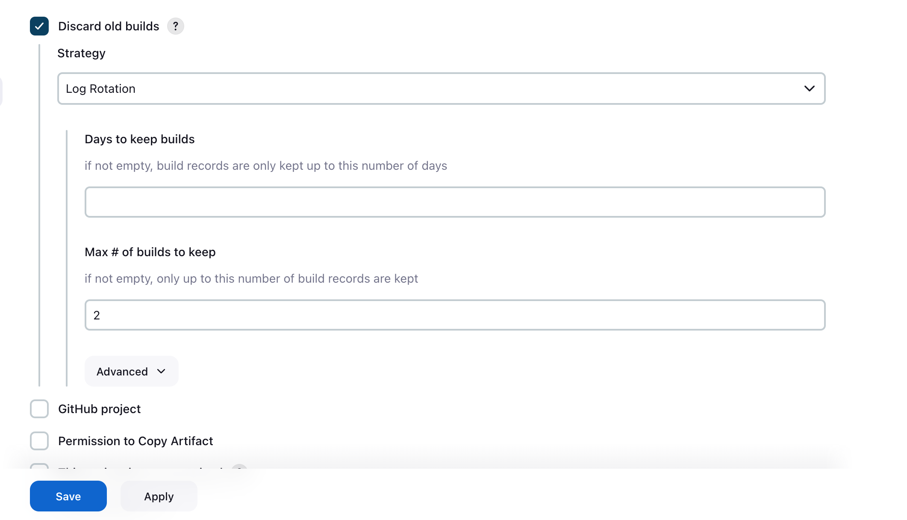
    - under Build Triggers: check build after other project are built; in project to watch put 'ansible'
    - Then save
    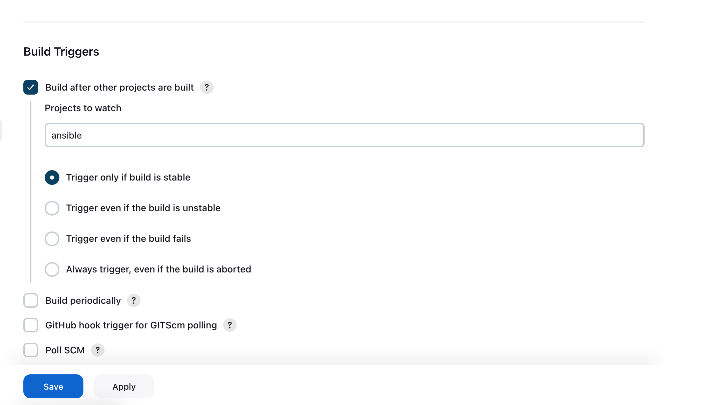

4. The main idea of save_artifacts project is to save artifacts into /hgitome/ubuntu/ansible-config-artifact directory. To achieve this, create a Build step and choose Copy artifacts from other project, specify ansible as a source project and /home/ubuntu/ansible-config-artifact as a target directory.
    - go to configuration of the new project 'save_artifacts'
    - under build steps
        - type ansibe as the project name
        - under artifacts to copy type '**'
        - under target directory; put - /home/ubuntu/ansible-config-artifact 
        - Save
    

5. Test your set up by making some change in README.MD file inside your ansible-config-mgt repository (right inside master branch).
If both Jenkins jobs have completed one after another – you shall see your files inside /home/ubuntu/ansible-config-artifact directory and it will be updated with every commit to your master branch.
    

# Step 2 – Refactor Ansible code by importing other playbooks into site.yml
    - git checkout main
    - git branch refactor
    - git checkout refactor
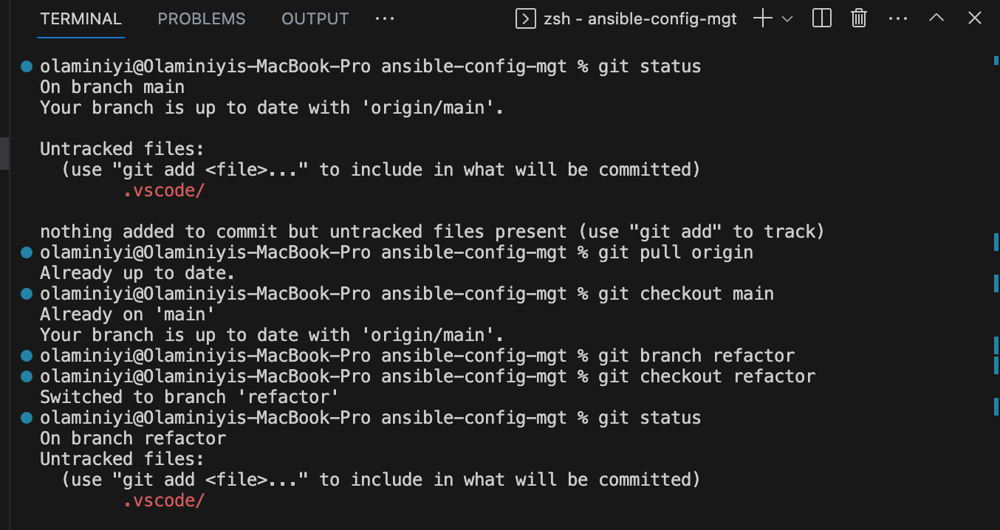

1. Within playbooks folder, create a new file and name it site.yml – This file will now be considered as an entry point into the entire infrastructure configuration. Other playbooks will be included here as a reference. In other words, site.yml will become a parent to all other playbooks that will be developed. Including common.yml that you created previously. Dont worry, you will understand more what this means shortly.
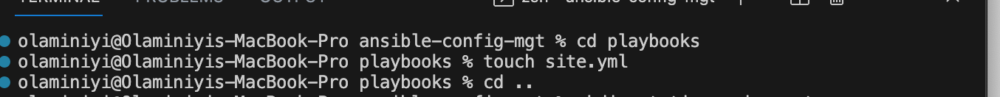

2. Create a new folder in root of the repository and name it static-assignments. The static-assignments folder is where all other children playbooks will be stored. This is merely for easy organization of your work. It is not an Ansible specific concept, therefore you can choose how you want to organize your work. You will see why the folder name has a prefix of static very soon. For now, just follow along.
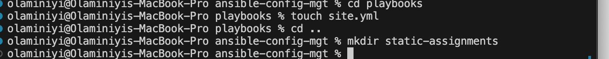

3. Move common.yml file into the newly created static-assignments folder.
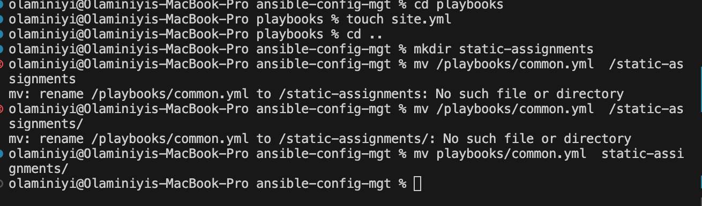

4. Inside site.yml file, import common.yml playbook.
[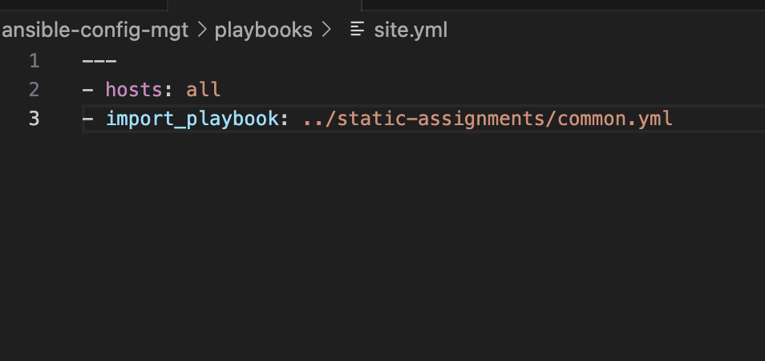

5. Run ansible-playbook command against the dev environment
    - Since you need to apply some tasks to your dev servers and wireshark is already installed – you can go ahead and create another playbook under static-assignments and name it common-del.yml. In this playbook, configure deletion of wireshark utility.
    
    - update site.yml with - import_playbook: ../static-assignments/common-del.yml instead of common.yml and run it against dev servers:
    
    
    - cd /home/ubuntu/ansible-config-mgt/
    - ansible-playbook -i inventory/dev.yml playbooks/site.yml
    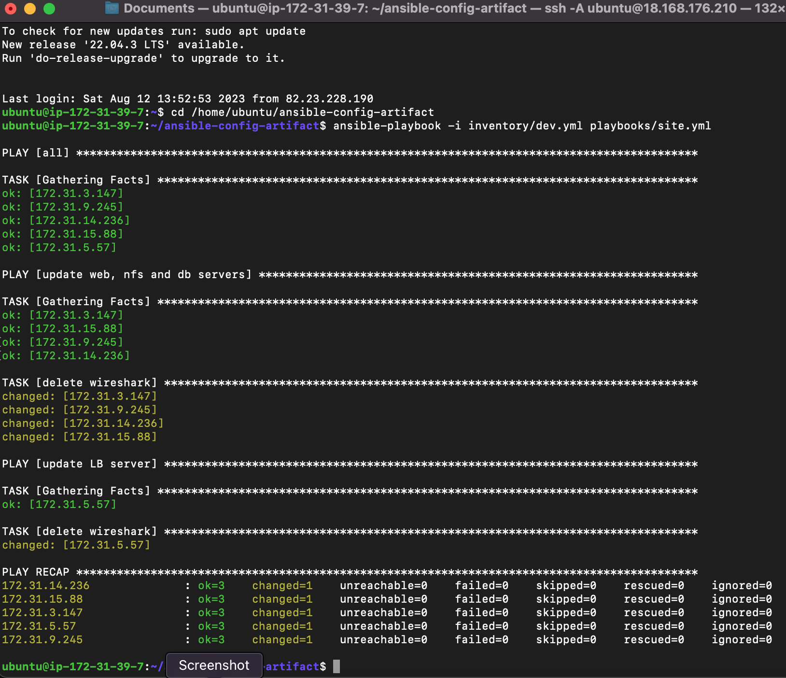

    - Make sure that wireshark is deleted on all the servers by running wireshark --version
    

#Step 3 – Configure UAT Webservers with a role ‘Webserver’
1. Launch 2 fresh EC2 instances using RHEL 8 image, we will use them as our uat servers, so give them names accordingly – Web1-UAT and Web2-UAT.

2. To create a role, you must create a directory called roles/, relative to the playbook file or in /etc/ansible/ directory.
    - There are two ways how you can create this folder structure:
    - Use an Ansible utility called ansible-galaxy inside ansible-config-mgt/roles directory (you need to create roles directory upfront)
    - mkdir roles
    - cd roles
    
    After removing unnecessary directories and files, the roles structure should look like this

└── webserver
    ├── README.md
    ├── defaults
    │   └── main.yml
    ├── handlers
    │   └── main.yml
    ├── meta
    │   └── main.yml
    ├── tasks
    │   └── main.yml
    └── templates

    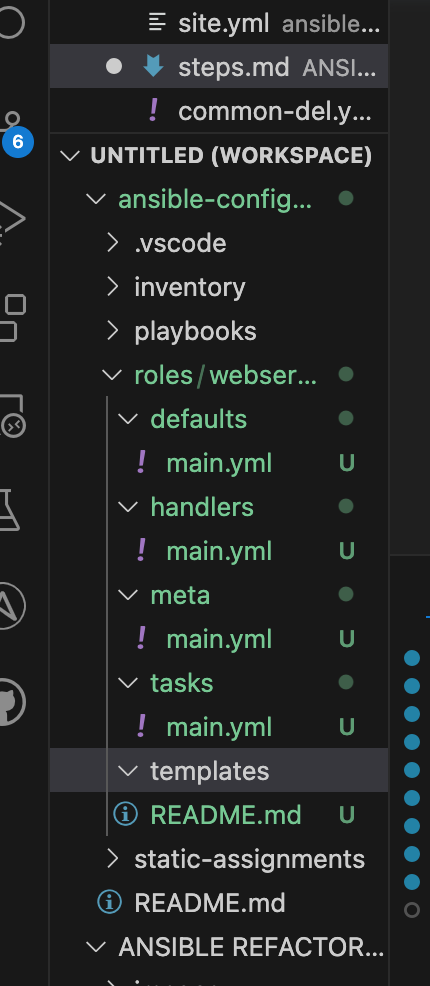

3. Update your inventory ansible-config-mgt/inventory/uat.yml file with IP addresses of your 2 UAT Web servers

4. In /etc/ansible/ansible.cfg file uncomment roles_path string and provide a full path to your roles directory roles_path    = /home/ubuntu/ansible-config-mgt/roles, so Ansible could know where to find configured roles.
    - ssh into ansible jenkins wit (ssh -A)
    - cd ansible-config-artifact
    - sudo vi /etc/ansible/ansible.cfg 
    - uncomment the roles_path and add the path to the roles to it. i.e /home/ubuntu/ansible-config-artifact/roles
    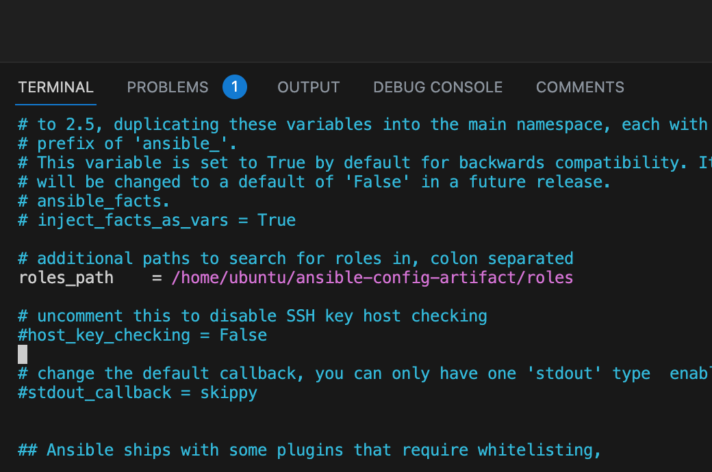

5. It is time to start adding some logic to the webserver role. Go into tasks directory, and within the main.yml file, start writing configuration tasks to do the following:
    - Install and configure Apache (httpd service)
    - Clone Tooling website from GitHub https://github.com/<your-name>/tooling.git.
    - Ensure the tooling website code is deployed to /var/www/html on each of 2 UAT Web servers.
    - Make sure httpd service is started
    

Step 4 – Reference ‘Webserver’ role
1. Within the static-assignments folder, create a new assignment for uat-webservers uat-webservers.yml. This is where you will reference the role.
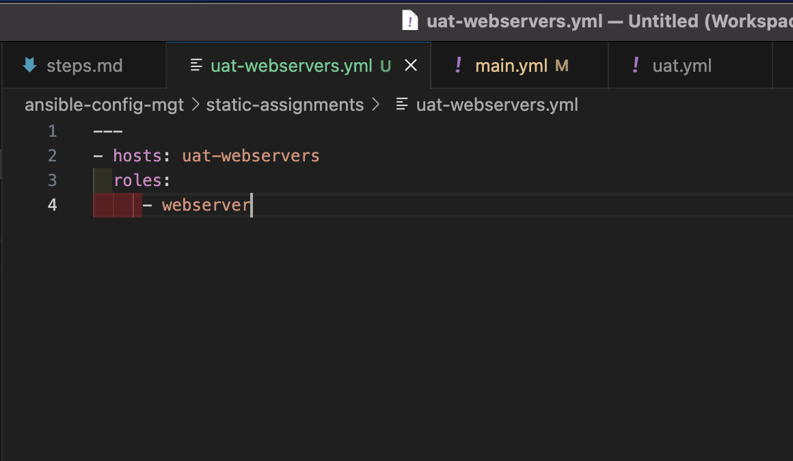
2. Remember that the entry point to our ansible configuration is the site.yml file. Therefore, you need to refer your uat-webservers.yml role inside site.yml.
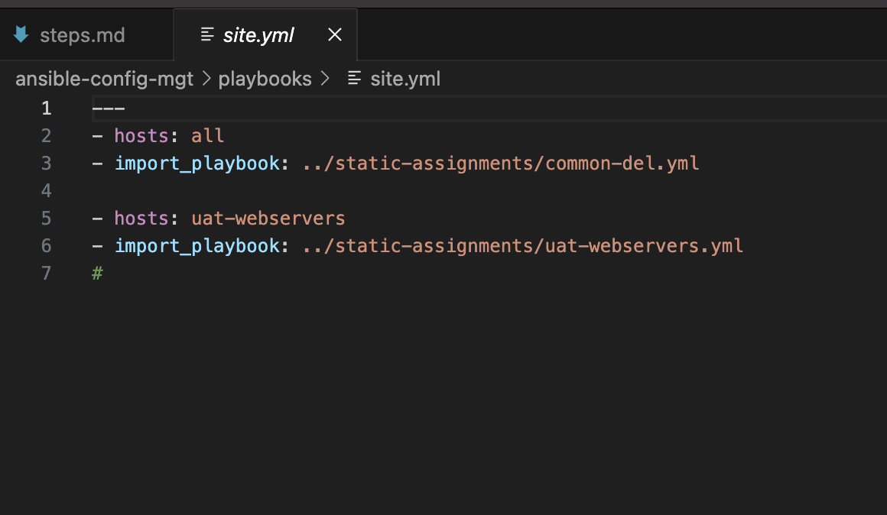

Step 5 – Commit & Test
1. Commit your changes, create a Pull Request and merge them to master branch, make sure webhook triggered two consequent Jenkins jobs, they ran successfully and copied all the files to your Jenkins-Ansible server into /home/ubuntu/ansible-config-mgt/ directory.

2. Now run the playbook against your uat inventory and see what happens
    - ansible-playbook -i inventory/uat.yml \playbooks/site.yml
    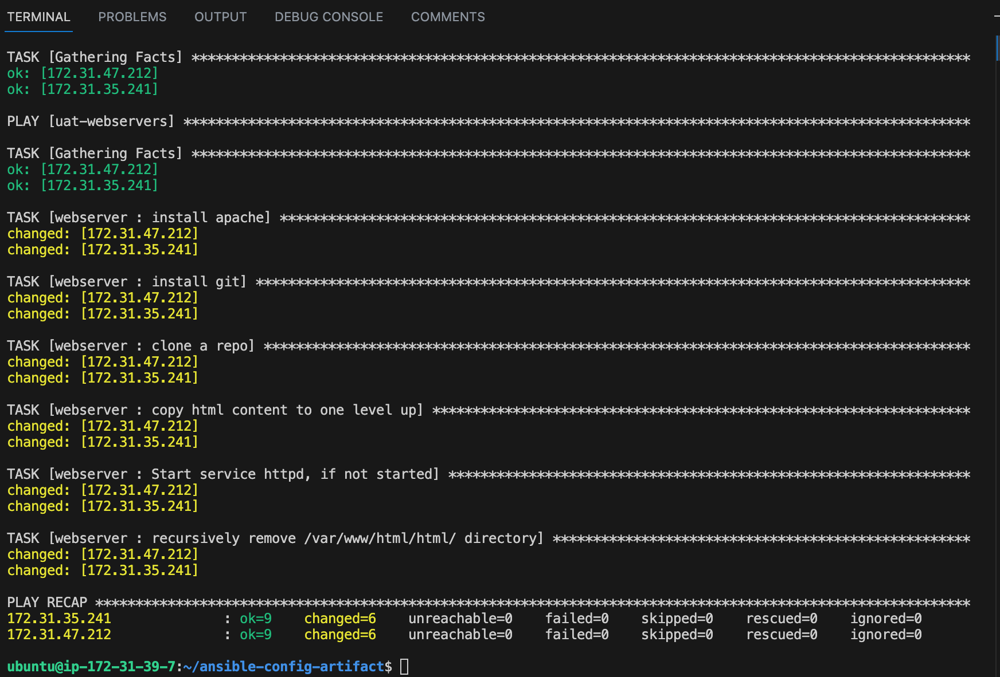

3. You should be able to see both of your UAT Web servers configured and you can try to reach them from your browser:
    1. web uat 1
    
    2. web uat 2
    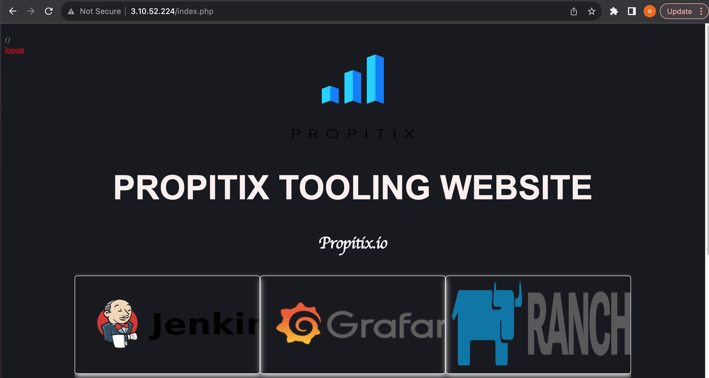

